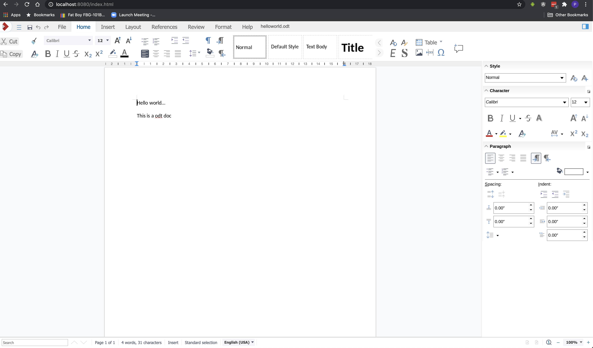

# Getting Started

1. Figure out your ip address `ifconfig | grep 192` (192.168.0.242 in my case).

2. Run the collabora code docker container as follows:

`docker run -t -d -p 9980:9980 -e "domain=192\\.168\\.0\\.242:8080" -e "username=admin" -e "password=secret" --restart always -e "extra_params=--o:ssl.enable=false" --cap-add MKNOD collabora/code`

3. Edit `src/main/resources/static.index.html` and ensure the WOPISrc is correct for your configuration:

`<form id="office_form" name="office_form" target="office_frame" action="http://localhost:9980/loleaflet/eec532f/loleaflet.html?WOPISrc=http%3A%2F%2F192.168.0.242%3A8080%2Fwopi%2Ffiles%2Fabcdef0123456789" method="post">`

4. Run this application

5. In a browser request http://localhost:9980/index.html

And you should see 

I am not convinced the editor is fully functional but that is probably because the endpoints are stubbed out and partially implemented.